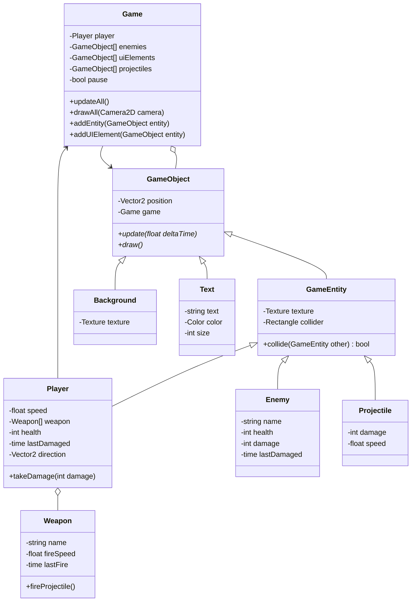

# UOA OOP Project

Object Oriented Programming Major Practical Assignment

## Build

To build this project, make sure to have CMake installed locally.

### Desktop

```
mkdir build
cd build
cmake ..
make
```

## Run

```
./game
```

## Class Diagram


