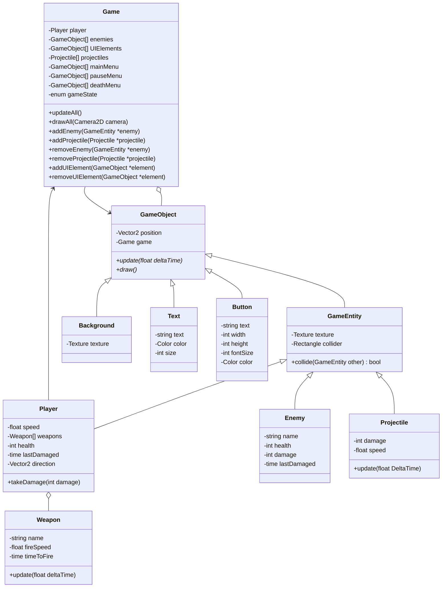

# Knight Survivor

Object Oriented Programming Major Practical Assignment

## Build

To build this project, make sure to have CMake installed locally.

```sh
mkdir build
cd build
cmake .. # Debug
cmake -DCMAKE_BUILD_TYPE=Release .. # Release
make
```

## Run

In `build` folder

```sh
./game # Game
./test_runner # Tests
```

## Class Diagram


